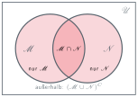

## So funktioniert eine Folie

Jede Folie beginnt mit `##`. Der Text danach wird zum Frametitel mit rotem Balken.

Darunter schreibst du ganz normales Markdown:

- Aufzählung mit `-`
- **fett** mit `**…**`, *kursiv* mit `*…*`
- `Code` mit Backticks

::: {.notes}
Drücke S — dann öffnet sich die Referentenansicht und du liest diesen Text.
Links siehst du die aktuelle Folie, rechts oben die nächste, darunter Uhr und
Stoppuhr. Das Fenster auf den Laptop-Bildschirm ziehen, die Folien auf den Beamer.
:::

## Sprechernotizen

Das Wichtigste zuerst — Notizen kommen in einen `.notes`-Block:

```markdown
## Editierdistanz

Sichtbarer Folieninhalt.

::: {.notes}
Hier steht, was nur du siehst.
Ruhig mehrere Sätze, Aufzählungen gehen auch.
:::
```

Auf der Folie taucht davon nichts auf. Sichtbar wird es in der
**Referentenansicht**: Taste `S` drücken, es öffnet sich ein zweites Fenster.

::: {.notes}
Der Pop-up-Blocker von Chrome kann das Fenster beim ersten Mal abfangen —
dann oben rechts in der Adressleiste auf "Zulassen" klicken. Danach merkt
Chrome sich das für diese Datei.
:::

## Die vier Blöcke

::: {.block .normal data-title="normal — der graue Standardblock"}
Für alles Normale: Definitionen, Erklärungen, Aufzählungen.
:::

::: {.block .example data-title="example — für Beispiele"}
Etwas heller, mit grauem Titel.
:::

::: {.block .alert data-title="alert — für Warnungen und Aufgaben"}
Rot hinterlegt. Für Merksätze, Fallstricke, Übungsaufgaben.
:::

::: {.block .info data-title="info — für Hinweise am Rande"}
Blau hinterlegt. Für Exkurse, Querverweise, Hintergrundwissen.
:::

::: {.notes}
Der Blocktitel steht im Attribut data-title. Er wird per CSS gesetzt, deshalb
kann dort nur Klartext stehen — keine Formel, kein Fettdruck. Wenn du das
brauchst, siehe die vorletzte Folie.
:::

## Schrittweise aufdecken

Drei Wege, je nachdem was du brauchst:

::: {.block .normal data-title="1. Ein Block erst auf Klick"}
`.fragment` an den Block hängen — wie bei diesem hier.
:::

. . .

**2. Ein Absatz erst auf Klick:** drei Punkte mit Leerzeichen auf eine eigene
Zeile — `. . .` — und alles danach erscheint später.

::: {.incremental}
- **3. Eine Liste Punkt für Punkt:**
- den `.incremental`-Block drumherum legen
- dann kommt jeder Punkt einzeln
:::

::: {.notes}
Der erste Block hat kein .fragment, damit du den Unterschied siehst.
In der Praxis: ::: {.block .normal .fragment data-title="…"}
:::

## Zwei Spalten

::: {.cols}
::: {.col}
::: {.block .normal data-title="Links"}
Der `.cols`-Block enthält beliebig viele `.col`-Blöcke.
:::
:::

::: {.col}
::: {.block .example data-title="Rechts"}
Sie teilen sich die Breite gleichmäßig auf.
:::
:::
:::

```markdown
::: {.cols}
::: {.col}          ← oder: ::: {.col style="flex:60"}
links
:::
::: {.col}
rechts
:::
:::
```

::: {.notes}
Ungleiche Breiten über style="flex:60" und style="flex:40" an den Spalten.
Wichtig: jede Ebene braucht ihr eigenes ::: zum Schließen.
:::

## Formeln, Bilder, Code

Im Fließtext: $\Theta(n \log n)$ — einfach in `$…$` setzen.

Abgesetzt mit `$$…$$`:

$$ \sum_{i=1}^{n} (n-i) = \frac{n(n-1)}{2} = \Theta(n^{2}) $$

::: {.cols}
::: {.col}
```
SelectionSort(A):
  for i = 1 to n-1:
    min = i
```
:::
::: {.col}
::: {.texfig}
{.fig width="240"}
:::
:::
:::

::: {.notes}
Pseudocode in ein normales Codeblock-Fence mit drei Backticks — ohne
Sprachangabe, dann bleibt es ungefärbt wie bisher.
Bilder relativ zum Ordner: figures/KAPITEL/datei.svg
:::

## Wenn Markdown nicht reicht

Für alles Ungewöhnliche — eigenes HTML, ein SVG, eine Tabelle im Booktabs-Look —
gibt es die Notausstiegs-Luke:

````markdown
```{=html}
<div class="block normal"><div class="bt">Titel mit $\log_b a$</div><div class="bb">

Hier drin ist wieder ganz normales Markdown erlaubt.

</div></div>
```
````

Die alten Klassen aus den bisherigen Decks funktionieren alle weiter:
`.bt` `.bb` `.code` `.ide` `.merge-ex` `table.cmp` `.tree`

::: {.notes}
Genau so ist der Master-Theorem-Block in Kapitel 03 gebaut, weil im Titel eine
Formel steht. Und so wurden die Animationsfolie in Kapitel 03 und der
Coddy-Editor in Kapitel 04 aus den alten Decks übernommen.
:::

## Spickzettel

::: {.cols}
::: {.col}
::: {.block .normal data-title="Schreiben"}
```
## Titel          neue Folie
**fett**  *kursiv*
- Liste
::: {.notes} … :::
::: {.block .normal
     data-title="T"} … :::
::: {.cols} ::: {.col} … ::: :::
. . .        Pause
$x$   $$x$$   Formel
[rot]{.hl}
```
:::
:::

::: {.col}
::: {.block .example data-title="Bauen und Vorführen"}
```
quarto preview datei.qmd
quarto render              alle

S   Referentenansicht
O   Übersicht aller Folien
F   Vollbild
E   Druckansicht
G   zu Folie springen
```
:::
:::
:::

::: {.notes}
quarto preview ist beim Schreiben das Angenehmste: Browser offen lassen,
speichern, Folien aktualisieren sich von selbst.
:::
